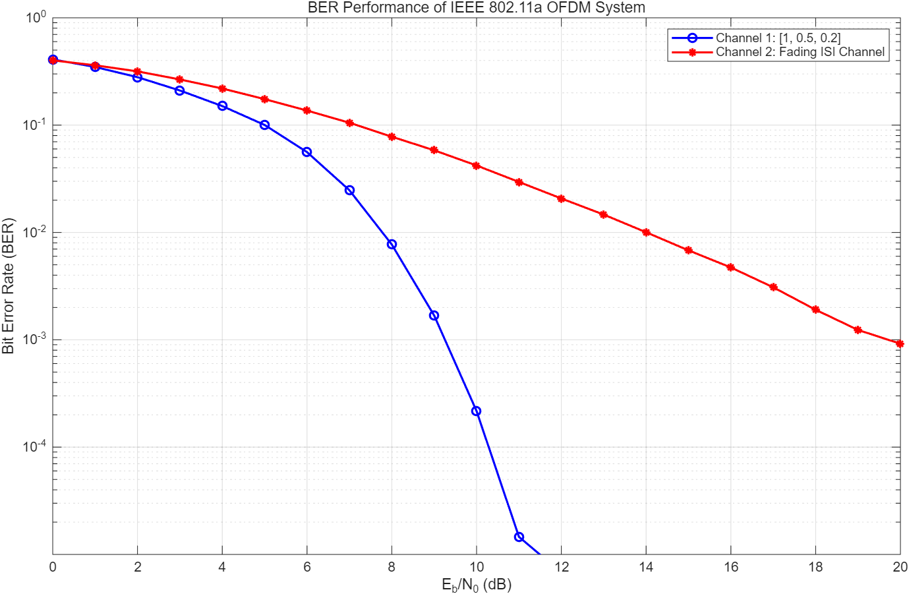

# OFDM PHY Link Simulator

MATLAB simulation of a coded OFDM physical-layer link with QPSK, convolutional coding, multipath fading, ZF equalization, Viterbi decoding, and BER evaluation.

## Overview

This project implements an end-to-end coded OFDM physical-layer link inspired by IEEE 802.11a parameters.

The system uses a 64-point OFDM waveform with a 16-sample cyclic prefix and evaluates the Bit Error Rate (BER) performance under both static multipath and block-fading channels.

## System

The simulated communication chain consists of:

**Transmitter**

Random Bits → Convolutional Encoding → QPSK Modulation → OFDM Modulation (IFFT) → Cyclic Prefix

**Receiver**

Cyclic Prefix Removal → FFT → Zero-Forcing Equalization → QPSK Demodulation → Viterbi Decoding → BER Calculation

Key system parameters:

- 64 OFDM subcarriers
- 16-sample cyclic prefix
- QPSK modulation
- Rate-1/2 convolutional coding
- Zero-Forcing frequency-domain equalization
- Hard-decision Viterbi decoding

## Channel Models

Two multipath channel models are considered:

### Static Multipath Channel

A fixed three-tap channel is used:

`h = [1, 0.5, 0.2]`

AWGN is added after multipath propagation.

### Block-Fading Multipath Channel

A three-tap complex Gaussian fading channel is independently generated for each OFDM symbol.

The average tap powers are:

`[0.7, 0.2, 0.1]`

AWGN is subsequently added to the received signal.

## Results

### BER Performance

The BER performance of the coded OFDM link is evaluated over an Eb/N0 range from 0 dB to 20 dB for both channel models.

The static three-tap multipath channel shows a rapid improvement in BER as Eb/N0 increases. Its BER decreases from approximately `4.1 × 10^-1` at 0 dB to `2.2 × 10^-4` at 10 dB, and falls below `10^-5` at approximately 12 dB.

In comparison, the block-fading multipath channel exhibits substantially slower BER improvement. Its BER is approximately `4.2 × 10^-2` at 10 dB, `6.8 × 10^-3` at 15 dB, and `9.2 × 10^-4` at 20 dB.

The performance difference illustrates the impact of random fading on the OFDM link. Although cyclic-prefix OFDM and frequency-domain Zero-Forcing equalization mitigate multipath-induced inter-symbol interference, deep fades can strongly attenuate individual subcarriers and amplify noise during Zero-Forcing equalization.

### Key Observations

- The static multipath channel achieves reliable performance at significantly lower Eb/N0.
- The block-fading channel produces a much higher BER because of random channel attenuation and deep fades.
- Increasing Eb/N0 consistently improves BER performance for both channel models.
- The results demonstrate the importance of channel conditions in determining the performance of a coded OFDM system.

## Tools

- MATLAB
- Communications Toolbox
